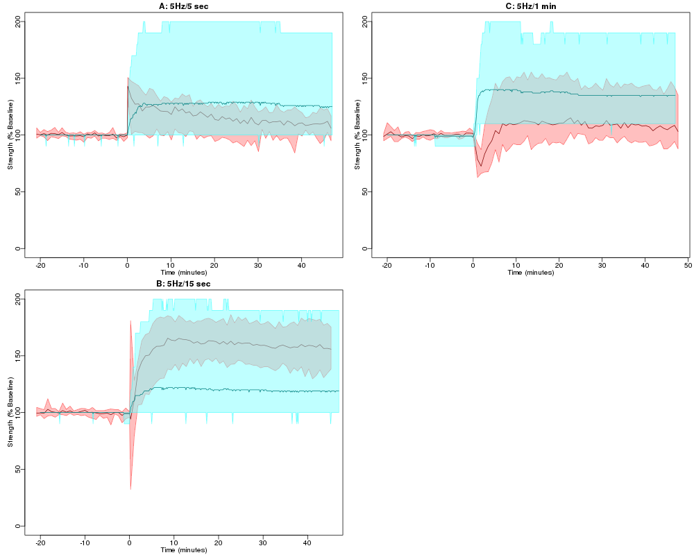

Proof-of-concept LTP-LTD simulations written in Kappa
=====================================================

Description
-----------

This is a proof-of-concept molecular model of synaptic plasticity
written in Kappa that contains the proteins calmodulin, PSD-95,
stargazin, Calcium-Calmodulin dependent kinase II (CaMII), PP3, I1 and
PP1. This model is presented with calcium stimuli of varying durations
and the synaptic strength in the model can be compared to the wild
type traces in Fig. 3 of Carlisle et al (2008), J. Physiol. 586.



In each plot the red line shows the mean of the Carlisle et
al. data, and the pink shaded region shows the maximum and minimum
extent of the data. The blue line shows the mean behaviour of
10 simulation runs, and the light blue shaded area shows the
minimum-to-maximum extent. The fit of simulation to experiment is
currently not good, but the model parameters have yet to be
optimised.

This simulation does demonstrate the utility of using Kappa to
simulate a model. The file [maguk.ka](maguk.ka) contains the
description of the model, demonstrating the ability of Kappa to
express state changes, such as phosphorylation and dephosphorylation,
and rules that depend on the states of the "agents" on the left hand
side of the rule. For example, to express phosphorylation of stargazin
by phosphorylated CaMKII, the following rule is used:
```
CaMKII(s~p), stargazin(c~u) ->  CaMKII(s~p), stargazin(c~p) @ 0.0001
```

This simplified model will be used as a basis for more complex models
that could, for example, incoporated more complete models of Ca-CaM
binding and CaMKII phosphorylation.

How to run
----------

* Install KaSim 4 from http://dev.executableknowledge.org/

* Run the script =run.R= from within R using =source("run.R")=

<!--  LocalWords:  LTP PSD CaMII Carlisle Physiol CaMKII incoporated
 -->
<!--  LocalWords:  Intall KaSim
 -->
