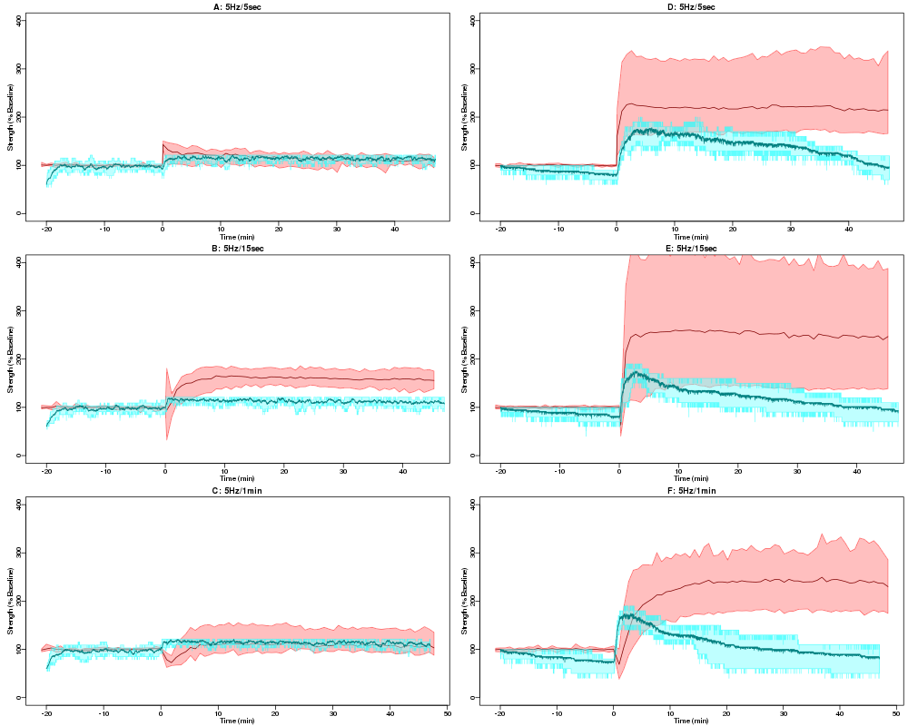

Proof-of-concept LTP-LTD simulations written in Kappa
=====================================================

Description
-----------

This is a proof-of-concept molecular model of synaptic plasticity
written in Kappa that contains the proteins calmodulin, PSD-95,
stargazin, Calcium-Calmodulin dependent kinase II (CaMII), PP3, I1 and
PP1. This model is presented with calcium stimuli of varying durations
and the synaptic strength in the model can be compared to the wild
type traces in Fig. 3 of Carlisle et al (2008), J. Physiol. 586.



In each plot the red line shows the mean of the Carlisle et
al. data, and the pink shaded region shows the maximum and minimum
extent of the data. The blue line shows the mean behaviour of
6 simulation runs, and the light blue shaded area shows the
minimum-to-maximum extent. The fit of simulation to experiment is
currently not good, but the model parameters have yet to be
optimised.

This simulation demonstrates the utility of using Kappa to simulate a
model. The files "volume4.ka", "agents4.ka", "ca4.ka", "cam4.ka",
"cb4.ka", "camkii4.ka", "pp34.ka", "pp1-camkii4.ka", "stargazin4.ka"
contain the description of the model, demonstrating the ability of
Kappa to express state changes, such as phosphorylation and
dephosphorylation, and rules that depend on the states of the "agents"
on the left hand side of the rule.

In particular, Kappa allows the full hexameric structure of the CaMKII
molecule to be expressed, along with phosphorylation of individual
subunits by calmodulin, and autophosphorylation of a subunit by its
neighbour.

How to run
----------

These instructions work for Ubuntu 16.04.

* In this directory install the development version of KaSim 4 from
2017-03-24 as follows:
```
apt install ocaml opam
opam init
opam pin add --dev KaSim

git clone https://github.com/jkrivine/KaSim.git
git checkout 76a8b98d135177c49
cd KaSim
make
```
* Make sure that R is installed
```
apt install r-base
```
* Install the required R package
```
R
install.packages("dplyr")
```
* Run the script `maguk-psd95-ko.R` from within R using `source("maguk-psd95-ko.R")`
<!--  LocalWords:  LTP PSD CaMII Carlisle Physiol CaMKII incoporated
 -->
<!--  LocalWords:  Intall KaSim ka cb camkii hexameric ocaml opam dev
 -->
<!--  LocalWords:  init cd dplyr maguk psd ko
 -->
